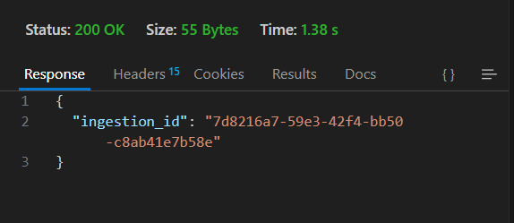
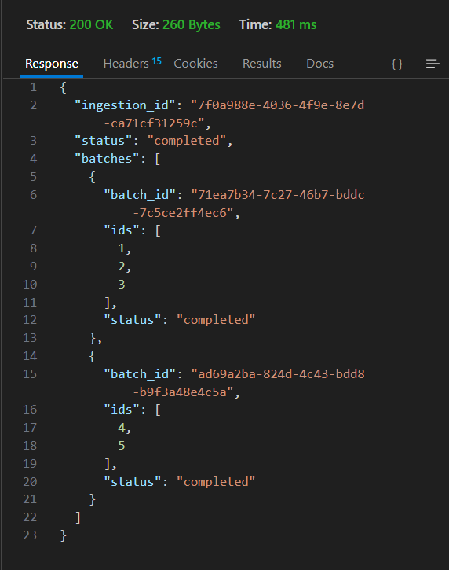
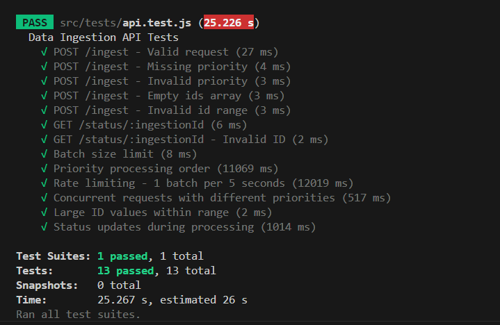

# Data Ingestion API System

A Node.js-based API system for handling data ingestion requests with priority-based processing and rate limiting.

## Features

- RESTful API endpoints for data ingestion and status checking
- Priority-based processing (HIGH, MEDIUM, LOW)
- Rate limiting (1 batch per 5 seconds)
- Batch processing (3 IDs per batch)
- Asynchronous processing with status tracking
- Comprehensive test suite

## Showcase

Here's a visual demonstration of the API system in action:


*/ingest endpoint*


*/status/:id endpoint*


*Tests Metrics*

## Prerequisites

- Node.js (v14 or higher)
- npm (v6 or higher)

## Installation

1. Clone the repository:
```bash
git clone https://github.com/himanshu-408/data-ingestion-api.git
cd data-ingestion-api
```

2. Install dependencies:
```bash
npm install
```

## Running the Application

1. Start the server:
```bash
npm start
```

For development with auto-reload:
```bash
npm run dev
```

The server will start on port 5000 by default. You can change this by setting the PORT environment variable.

## API Endpoints

### 1. Submit Ingestion Request
```
POST /ingest
Content-Type: application/json

{
  "ids": [1, 2, 3, 4, 5],
  "priority": "HIGH"
}
```

Response:
```json
{
  "ingestion_id": "uuid-string"
}
```

### 2. Check Status
```
GET /status/:ingestion_id
```

Response:
```json
{
  "ingestion_id": "uuid-string",
  "status": "triggered",
  "batches": [
    {
      "batch_id": "uuid-string",
      "ids": [1, 2, 3],
      "status": "completed"
    },
    {
      "batch_id": "uuid-string",
      "ids": [4, 5],
      "status": "triggered"
    }
  ]
}
```

## Running Tests

```bash
npm test
```

## Design Decisions

1. **In-Memory Storage**: The system uses in-memory storage (Map) for simplicity. In a production environment, this should be replaced with a persistent database.

2. **Priority Queue**: The system implements a priority queue that sorts requests based on priority and creation time.

3. **Batch Processing**: IDs are processed in batches of 3 to respect the rate limit of 1 batch per 5 seconds.

4. **Asynchronous Processing**: The system uses async/await for handling asynchronous operations and maintains a processing queue.

5. **Status Tracking**: Each ingestion request and its batches are tracked with status updates (yet_to_start, triggered, completed).

## Error Handling

The API includes comprehensive error handling for:
- Invalid input validation
- Missing required fields
- Invalid ID ranges
- Invalid priority values
- Non-existent ingestion IDs

## Rate Limiting

The system enforces a rate limit of 1 batch per 5 seconds, ensuring that no more than 3 IDs are processed within this timeframe.

## Priority Processing

Requests are processed based on their priority (HIGH > MEDIUM > LOW) and creation time. Higher priority requests are processed before lower priority ones, regardless of when they were submitted.